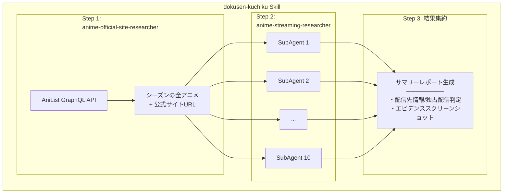

# 独占配信アニメ録画し忘れを<br>一匹残らず駆逐する


<style>
h1 {
  background: linear-gradient(135deg, #667eea 0%, #764ba2 100%);
  -webkit-background-clip: text;
  -webkit-text-fill-color: transparent;
  font-size: 2.2em !important;
  line-height: 1.4 !important;
}
</style>

---

# 自己紹介

<div class="flex justify-between items-center mt-4">
<div class="flex-1">

<div class="mb-4">
<span class="text-gray-400 text-sm">Name</span>

### 中井 亮
</div>

<div class="mb-4">
<span class="text-gray-400 text-sm">Team</span>

PF開発本部 第一開発部<br>CSプラットフォーム AIチーム
</div>

<div>
<span class="text-gray-400 text-sm">bio</span>

- 1000作品以上見てきたアニメグルイ
- 最近はゴールデンカムイが面白い

</div>

</div>
<div class="ml-8">

</div>
</div>

---

# アニメオタクの憂鬱

<v-clicks>

- 独占配信が毎シーズン悩みの種
- 配信がなくてもTV放送はあることが多く、録画できる
- 毎シーズン **約50作品** の配信先を調べる必要がある
- 既存情報源（まとめサイト、YouTuber）は **不完全**

- **メダリスト2期** が独占配信だと知らず、録画しそこねた...
- 繰り返される惨劇を終わらせるため、公式サイトをスクレイピングする決意


</v-clicks>

<!--
アニメファン全般が共感できる問題提起。
人手でやると大変 → 自動化したいというモチベーション。
-->

---
clicks: 2
---

# アニメ公式サイトのカオス

<div class="grid grid-cols-2 gap-8">
<div>

- 記載場所がバラバラ
  - トップページ / /onair/
- 記載内容の解釈が必要
  - 「個別課金」「都度課金」→ 実質見放題ではない
- シーズンごとに配信先が異なる


</div>
<div>


</div>
</div>

<!--
最も重要な技術的チャレンジ。
AIにルールではなく原則を与えるという設計判断が肝。
スクリーンショットで具体例を見せる。
-->

---
class: flex items-center justify-center text-center
---

<div class="text-3xl leading-relaxed">

AI に都度判断させてエージェンティックに探索させれば...?


<v-clicks>

**Claude Code** ならなんとかできるんじゃね？
</v-clicks>

</div>

---

# 処理フロー概要




**3つのSkill + 1つのサブエージェント** で構成


<!--
全体像を見せてから、各チャレンジの詳細に入る。
処理の流れをシンプルに伝える。
-->

---
layout: center
---

# 覚えておけ、ClaudeCodeの力はこうやって使う

<video src="/動作の様子_large.mp4" controls class="w-full h-full object-contain" />

<!--
ここで「おお」と思わせる。実際の出力を見せることで説得力を持たせる。
テーブルでサマリー、スクリーンショットでエビデンスを示す。
-->

---

# サマリレポート（途中までの実行結果）


---
clicks: 1
---

# どこを参照して回答したかハイライトしてレポート


---

# 残る課題

<v-clicks>

- **コスト**: Opus 4.6、検証、動作確認するだけで$60
  - 安いLLM（Kimi k2.5 等）の活用を検討中
- **コマンド許可確認地獄**
  - `--dangerously-skip-permissions` 以外の回避策が乏しい
  - 10並列でも確認ラッシュで画面に張り付き...
- **定期バッチでも自動実行したい！**:
  - Lambdaとかで動かしたいが、15分制限に引っかかりそう

</v-clicks>

<!--
正直に課題を共有する。コストと許可確認の2つが大きな壁。
-->

---

# 得られた知見

<v-clicks>

1. **未知の課題には具体コード例より原則を書く**
   - AI が柔軟にHowを考えてくれる
2. **MCP より Skill + Bash が適切なケースがある**
   - ポータビリティ、並列実行、オーケストレーション
3. **Skill は単一責任で分割する**
   - オーケストレーション + 単体テスト可能な小さいSkill
   - LLM の不安定さを小さい範囲でテストしやすくなる
4. **コーディングだけじゃないClaudeCodeさん**
   - コーディング以外でも十分な汎用性、自律改善
   - ClaudeCodeのSkillの動作評価だけは人間がやらざるを得ない

</v-clicks>

<!--
「目」を与えれば環境からフィードバックを得て自律改善
ClaudeCodeによってClaudeCodeを操作する方法がないため、

持ち帰りポイント3つ。
Claude Codeプラグイン開発に限らず、LLMを活用した開発全般に使える知見。
-->

---

# プラグインとして公開

<div class="mt-8">

- Claude Code **Marketplace** にプラグインとして公開
- プラグイン名: `streaming-jinarashi`

</div>

<div class="mt-6">

<a href="https://github.com/sniper-fly/souma-recette/tree/main/plugins/streaming-jinarashi" target="_blank" class="text-blue-400 hover:underline text-lg">
github.com/sniper-fly/souma-recette/.../streaming-jinarashi
</a>

</div>

<div class="mt-6 text-sm opacity-80">

以下の2コマンドでClaudeCodeで即時利用可能

</div>

```bash
/plugin marketplace add sniper-fly/souma-recette
/plugin install streaming-jinarashi@souma-recette
```

---
layout: center
---

# 俺達の戦いはこれからだ！


<div class="text-center mt-8 text-lg opacity-80">

アニメについておしゃべりしたり<br>
こういう開発を行う「あにめぶ！」サークルを作る予定です

興味がある方はぜひお声がけください！

</div>


<!--
最後にサークル告知。連絡先やリンクがあればここに追加。
-->
