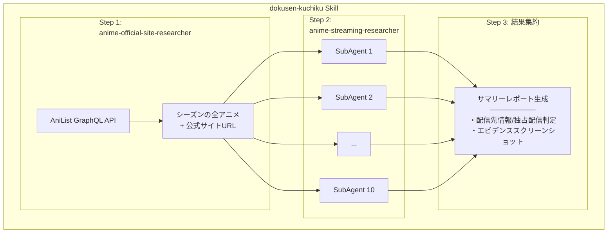

# 独占配信アニメ録画し忘れを<br>一匹残らず駆逐する


<style>
h1 {
  background: linear-gradient(135deg, #667eea 0%, #764ba2 100%);
  -webkit-background-clip: text;
  -webkit-text-fill-color: transparent;
  font-size: 2.2em !important;
  line-height: 1.4 !important;
}
</style>

---

# 自己紹介

<div class="flex justify-between items-center mt-4">
<div class="flex-1">

<div class="mb-4">
<span class="text-gray-400 text-sm">Name</span>

### 中井 亮
</div>

<div class="mb-4">
<span class="text-gray-400 text-sm">Team</span>

PF開発本部 第一開発部<br>CSプラットフォーム AIチーム
</div>

<div>
<span class="text-gray-400 text-sm">Favorite</span>

- ゴールデンカムイ
- 進撃の巨人
- 響け！ユーフォニアム
- けいおん！

</div>

</div>
<div class="ml-8">

</div>
</div>

---

# アニメオタクの憂鬱

<v-clicks>

- 独占配信が毎シーズン悩みの種
- 配信がなくてもTV放送はあることが多く、録画できる
- 毎シーズン **約50作品** の配信先を調べる必要がある
- 既存情報源（まとめサイト、YouTuber）は **不完全**


</v-clicks>

<!--
アニメファン全般が共感できる問題提起。
人手でやると大変 → 自動化したいというモチベーション。
-->

---

# メダリスト2期の悲劇

<v-clicks>

- **メダリスト2期** が独占配信だと知らなかった
- 1話を録画し損ねた...
- もうこの惨劇を繰り返すまいと決意
- スクレイピングで解決したいが、アニメ公式サイトの配信情報の記述パターンがバラバラ
- 人間は読めばわかるが、機械的なスクレイピングが難しい
- **Claude Code** ならなんとかできるんじゃね？

</v-clicks>

<!--
個人的な体験から入る。メダリストは人気作なので共感を得やすい。
「独占配信だと知らずに録画し損ねた」というあるあるネタ。
機械的なスクレイピングが難しい
-->


---

# 処理フロー概要



<v-click>

**3つのSkill + 1つのサブエージェント** で構成


</v-click>

<!--
全体像を見せてから、各チャレンジの詳細に入る。
処理の流れをシンプルに伝える。
-->

---
layout: center
class: p-0
---

<video src="/動作の様子.mp4" controls class="w-full h-full object-contain" />

<!--
ここで「おお」と思わせる。実際の出力を見せることで説得力を持たせる。
テーブルでサマリー、スクリーンショットでエビデンスを示す。
-->

---
clicks: 2
---

# Challenge 1: 公式サイトのカオス

<div class="grid grid-cols-2 gap-8">
<div>

- 記載場所がバラバラ
  - トップページ / /onair/
- 記載内容の解釈が必要
  - 「個別課金」「都度課金」→ 実質見放題ではない
- シーズンごとに配信先が異なる
- AI に都度判断させてエージェンティックに探索させる


</div>
<div>


</div>
</div>

<!--
最も重要な技術的チャレンジ。
AIにルールではなく原則を与えるという設計判断が肝。
スクリーンショットで具体例を見せる。
-->

---

# Challenge 2: コンテキストの壁

<v-clicks>

- 50作品を **1コンテキスト** で順番に処理
  - 不安定 & 遅い
- サブエージェントを **作品ごとに起動** し、コンテキストを分離
- **最大10並列** で処理

</v-clicks>

<v-click>

```
dokusen-kuchiku（オーケストレーション）
  ├── サブエージェント #1  → ゴールデンカムイ
  ├── サブエージェント #2  → TRIGUN STARGAZE
  ├── サブエージェント #3  → 地獄楽
  │   ...
  └── サブエージェント #10 → (次のバッチを待機)
```

</v-click>

<!--
LLMの実用的な制約と、サブエージェントによる解決策。
1コンテキストに詰め込むのではなく分離するのがポイント。
-->

---

# Challenge 3: MCP並列実行の壁

<v-clicks>

- **Playwright MCP**: セッション共有で並列実行不可
- MCPサーバー10個起動案 → 権限管理が煩雑すぎて断念
- **Playwright CLI** + セッション分離（`-s=` オプション）で解決

</v-clicks>


<v-click>

**MCPよりCLIがシンプルなケースもある**

statefulなリソースの並列利用に弱い

</v-click>

<!--
- MCPはツール定義だけで大量のトークン消費
- ポータビリティ
- 他のツールとの組み合わせ
MCPが万能ではないことを示す実例。
CLIならBashツールの許可だけで動くのでポータビリティも高い。
playwrightなら公式のSkillもあるのでMCPますます要らない
-->

---

# サマリレポート（途中までの実行結果）


---
clicks: 1
---

# どこを参照して回答したかハイライトする


---

# 残る課題

<v-clicks>

- **コスト**: Opus 4.6で1作品 $0.4 → 50作品で **$20**
  - 安いLLM（Kimi k2.5 等）の活用を検討中
- **コマンド許可確認地獄**
  - `--dangerously-skip-permissions` 以外の回避策が乏しい
  - 10並列だと確認ラッシュで画面に張り付き...

</v-clicks>

<!--
正直に課題を共有する。コストと許可確認の2つが大きな壁。
-->

---

# 得られた知見

<v-clicks>

1. **未知の課題には具体コード例より原則を書く**
   - AI が柔軟に対応できる
2. **MCP より Skill + Bash が適切なケースがある**
   - ポータビリティ・並列実行
3. **「不明点は AskUserQuestion で確認」のプロンプト**
   - あらゆる設計で使える汎用テクニック
4. **Skill は単一責任で分割する**
   - オーケストレーション + 単体テスト可能な小さいSkill
   - LLM の不安定さを小さい範囲でテストしやすくなる

</v-clicks>

<!--
持ち帰りポイント3つ。
Claude Codeプラグイン開発に限らず、LLMを活用した開発全般に使える知見。
-->

---

# プラグインとして公開

<div class="mt-8">

- Claude Code **Marketplace** にプラグインとして公開
- プラグイン名: `streaming-jinarashi`

</div>

<div class="mt-6">

<a href="https://github.com/sniper-fly/souma-recette/tree/main/plugins/streaming-jinarashi" target="_blank" class="text-blue-400 hover:underline text-lg">
github.com/sniper-fly/souma-recette/.../streaming-jinarashi
</a>

</div>

<div class="mt-6 text-sm opacity-80">

以下の2コマンドでClaudeCodeで即時利用可能

</div>

```bash
/plugin marketplace add sniper-fly/souma-recette
/plugin install streaming-jinarashi@souma-recette
```

---
layout: center
---

# 俺達の戦いはこれからだ！

<v-click>

<div class="text-center mt-8 text-lg opacity-80">

アニメについておしゃべりしたり<br>
こういう開発を行うサークルを作る予定です

興味がある方はぜひお声がけください

</div>

</v-click>

<!--
最後にサークル告知。連絡先やリンクがあればここに追加。
-->
