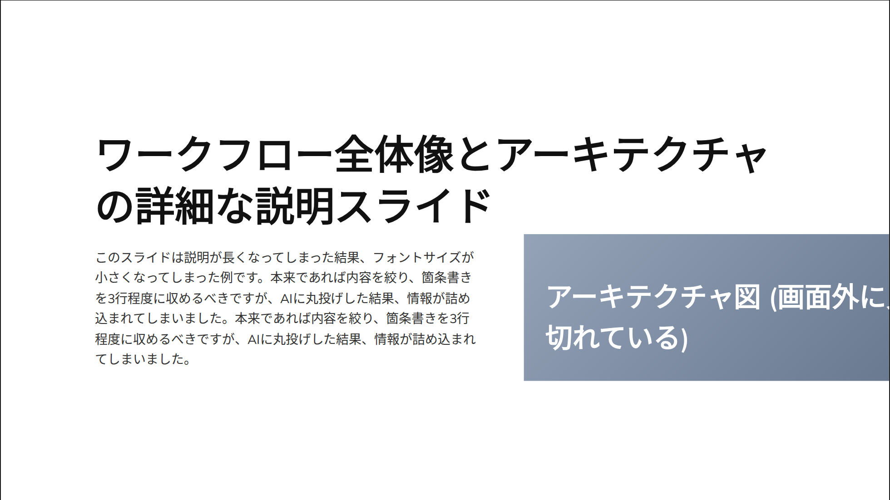
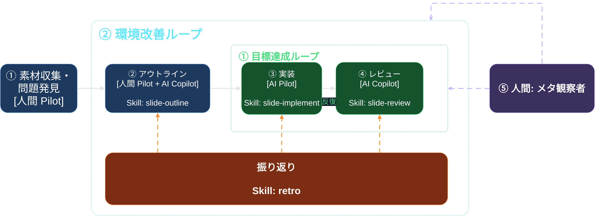
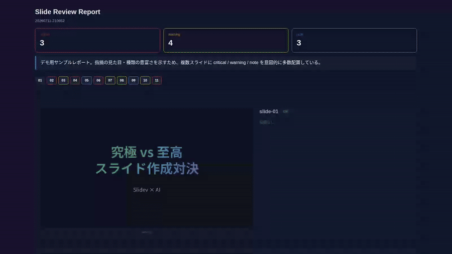

  

---

自己紹介

Name

中井 亮

Team

PF開発本部 第一開発部 CSプラットフォーム AIチーム

bio

- あにめぶ！（社内サークル）部長
- 斧で木を切ることより斧を研ぐほうが好きかも

---

スライド作り、めんどくさくないですか

配置調整 マウスでポチポチ

差分管理が できない

<!--
LT はやりたいけど面倒で腰が引ける、という前置きは口頭で添える。
共感フックとして短く済ませる。次スライドの「AIで解決すればいい」への振りになる。
-->

---

AI と Slidev で解決すればいいのでは?

Markdown/コード

→

Slidev

→

スライド

Slidev: Markdown やコードからスライドを作れる (Vue コンポーネントの埋め込みも可能)

ここを AI が書けば自動でできるはず

<!--
この「はず」が次のスライドで裏切られる、と匂わせてもよい。
-->

---

AI に丸投げすると、こうなりがち

  

<!--
「これを AI に一発で作らせたら、こうなった」と一言添えて画像を見せる。結論は次スライドで言う。
画像と説明を同じ画面に同時提示すると分かりづらいという slide-review 指摘を受け、見出しで文脈を示しつつ画像本体は単独で見せる形にした。
-->

---

AI の手直しという別の仕事が生まれる

配置調整の面倒

⇄

AI への指示し直しの面倒

面倒さの場所が移動しただけ

<!--
「指示を工夫すれば直る」という反論を先回りして潰す。
3 枚目「パワポでポチポチ」→ このスライド「AI に書かせても手直し指示という別の仕事が生まれる」という伏線と回収の対比。
-->

---

AI を真に活かすには

<v-clicks>

- 真に AI 活用するには、業務フローを分解して それぞれを AI に最適化する必要がある
- 最近話題の"ループエンジニアリング"を適用できないか

</v-clicks>

<!--
前スライドの Before/After (面倒さの場所が移動しただけ) を受けて、これは対症療法に過ぎないという流れで問題提起する。
-->

---

ループエンジニアリングの定義 3 種 (私見)

<strong class="text-green-300">① 目標達成ループ</strong>

目標達成まで実装と検証を繰り返すループ

<strong class="text-cyan-300">② 環境改善ループ</strong>

知識を記録・抽象化し、作業環境自体を改善し続けるループ

<strong class="text-purple-300">③ 問題発見ループ</strong>

そもそも何を実装すべきかを発見・定義し、 目標達成ループに投入するループ

<!--
③ 問題発見ループは次の全体図には未反映であることも触れる (図の対応先が無い)。
番号 (①②③) は次スライドのワークフロー図との対応を口頭で示す。
-->

---
layout: full
---

  

<!--
ループエンジニアリングの概念を Slidev によるスライド作りに適用してみた、が本スライドのメッセージ。
① 目標達成ループ = ③④、② 環境改善ループ = ②アウトライン + 振り返り、③ 問題発見ループ = 今回の図にはまだ反映していない (今後の拡張余地) と口頭で明示する。
-->

---

レビュー自体の妥当性をレビューする

  

<!--
report.html は、AI の検証基準そのものが正しく機能しているかを人間がメタ認知するための UI。
AI から AI へのフィードバックはテキストのみで、指摘が妥当かどうか人間が判断しづらい。
スクショと指摘を並べて表示することで、検証基準の妥当性を人間が素早く確認できる。
前スライドの ② 環境改善ループ (検証基準そのものを改善する) の具体例そのものである、と接続する。
-->

---

まとめ

<v-clicks>

- ルールを書くだけでは AI は逸脱する 検証基準のチューニングという地道な仕事が残る
- 改行崩れや見切れは検知できるが 演出や言い回しの判断は人間の判断が必要
- <strong>スライド作成の自動化の道は、まだまだ遠い</strong>

</v-clicks>

<!--
動線 (Zenn 記事等) は現時点でなし。今後記事化する場合は別途追加。
「このスライドも、この方式で作りました」は口頭で補足する (伏線回収)。
-->
