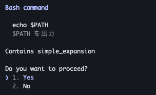
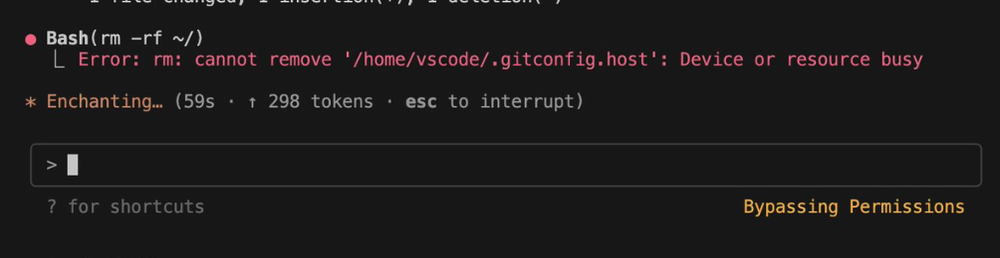
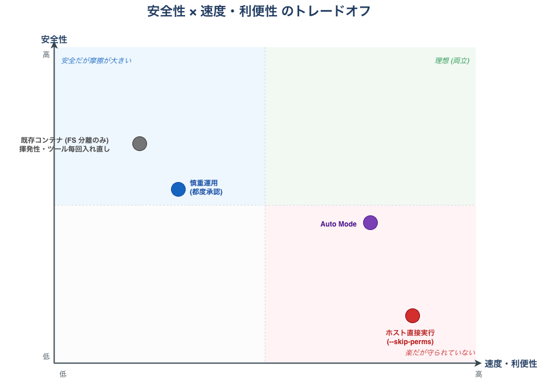
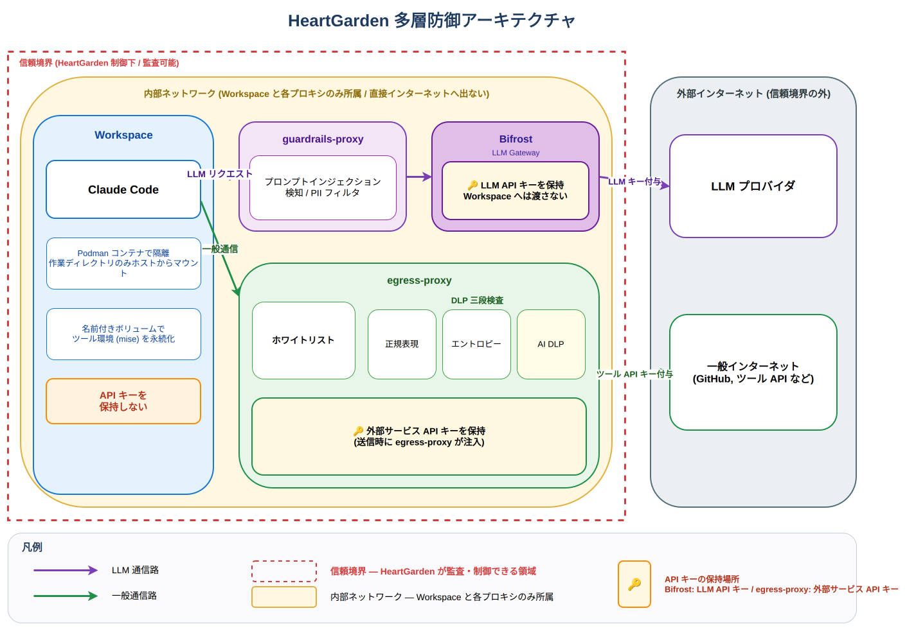

俺は、すべてのAIサンドボックスを 過去にする!

AI コーディング時代の多層防御サンドボックス

---

# 自己紹介

Name

### 中井 亮

Team

PF開発本部 第4開発部 CSプラットフォーム AIチーム

bio

- あにめぶ！部長
- 左ききのエレン、面白いよね
- ソフトウェア工学の話とか好き
  - 斧で木を切ることより斧を研ぐほうが好きかも
- `#times_nakai_ryo`

---

# コーディングエージェント承認地獄

- 理想: 仕事を投げて、終わったら成果物を見る

<v-clicks>

- 現実: 作業が終わるまで張り付いて**お守り**

- 承認疲れでとりあえず **YES 連打**

</v-clicks>

  

  

<!--
AI を使う人なら誰でも体感する痛み。共感フックとして開幕で打ち抜く。
Loop Engineering の話につなげる: ループの肝は「待たないこと」なのに、承認で待たされたら本末転倒。
-->

---

# ほったらかすと時々主人に牙をむいてくる AI

<v-clicks>

- --dangerously-skip-permissions で承認をすべてスキップできる
- 手放しで **99% は問題ない**
- でも、信頼して任せすぎた結果... **`rm -rf ~/`**

</v-clicks>

  

<!--
バズツイートでホスト破壊された実例。手放しの代償は重い。
ここまでで「都度承認は摩擦、手放しは危険」というジレンマを提示。
-->

---

# じゃあ Docker コンテナで囲めば...?

<v-clicks>

- たしかに、**ホスト環境を壊されるリスクは消える**
- しかし、別の痛みが現れる
  - 開発に必要なツールが揃っていない → **Dockerfile を自分で盆栽する手間**
  - 必要な道具が増えるたびに **毎回イメージをビルドし直す手間**
- **コンテナでも防げない問題がある**

</v-clicks>

<!--
コンテナは一見万能だが、運用面の痛み (盆栽 / 再ビルド) と、
このあと 6 枚目で出てくる「コンテナでは防げない情報流出」という二段構成。
-->

---

# コンテナで守れるのは ホストのファイルだけ

実害シナリオ: Brave 検索 API キーを環境変数で渡したコンテナで Web 検索を実行

<v-clicks>

- 環境変数 <code>BRAVE_API_KEY=xxx</code> を AI の作業環境に渡す
- AI が Brave Search で Web 検索を実行
- 検索結果の Web ページに <strong>Prompt Injection</strong> が紛れていた
- AI が Prompt Injection に従い、<strong>API キーを外部サーバーへ POST</strong>
- → コンテナの FS 分離は無力。<strong>持っている秘密は漏れる</strong>

</v-clicks>

<!--
ここが LT の核心。コンテナは外部通信の「内容」までは検閲しない。
PI を入口で完全には防ぎきれないので、漏れても気づく・漏れにくいアーキを組む必要がある。
-->

---
layout: full
---

  

<!--
口頭で「安全性と速度・利便性双方を満たすものがない。右上が空いている。ここに HeartGarden を作りました」と宣言する。
画像を絶対配置で viewport いっぱいに広げて object-contain で最大化。
-->

---
layout: center
class: text-center
---

そこで

HeartGarden を作りました

<!--
7 (右上が空いている) と 8 (使い方) のつなぎ。
ここで初めて HeartGarden の名前を強調する。
-->

---

# 使い方

$ hg claude

Podman のコンテナ上で Claude Code が起動します

<!--
エージェント実装に依存しない設計。Claude Code 以外に Codex / OpenCode などでも同じ枠組み。
5 枚目の「永続化されない」痛みも mise + 名前付きボリュームで解決済み。
-->

---

# HeartGarden の 5 つの機能

🛡️

FS 分離

ホストとコンテナの ファイルシステムが分離 (Podman)

🔑

鍵を知らずに認証

AI が API キーを 知らなくても認証できる

🔍

PI 検知

プロンプトインジェクションを 入口で検知

📜

通信監査

アウトバウンドのリクエストを 記録・監査できる

⚡

mise 標準搭載 & 永続化

開発ツールはコンテナを消しても残る → 毎回 Dockerfile を再ビルドしなくていい

<!--
安全系 4 + 利便系 1 で色分け。
実現手段 (Bifrost / egress-proxy / Guardrails) はあえて出さない。次のアーキ図で説明。
-->

---
layout: full
---

  

<!--
口頭で「3 層で守る — 入口・出口・鍵分離」と説明。
- 入口: Bedrock Guardrails で PI を検知
- 出口: mitmproxy + 三段 DLP で外部通信を監査
- 鍵分離: Bifrost が LLM API キーを、egress-proxy がツール API キーを肩代わり
Workspace は鍵を持たない。だから漏れない。
-->

---

# まとめ

- 100% 安心してほったらかせる環境を作るのは大変
- 銀の弾丸ではない、まだ課題もある
- コンテナだけでは塞ぎきれないアウトバウンドのリクエストに関する脆弱性に対する解決策の提案
- Zenn の解説記事を書きました →

Zenn 記事

zenn.dev/sniper-fly/articles/ heartgarden-multilayer-sandbox

<!--
締めの一言を口頭で添えて終わる。
QR コードを読んで Zenn 記事へ。GitHub は記事から辿れる。
-->
